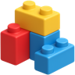

<p align="center">
  <a href="https://platform-blocks.com/" rel="noopener" target="_blank"></a>
</p>

<h1 align="center">Platform Blocks</h1>

<div align="center">

[](https://github.com/joshstovall/platform-blocks/blob/HEAD/LICENSE)
[](https://www.npmjs.com/package/@platform-blocks/ui)
[](https://discord.gg/wbH82zuWMN)

</div>

[Platform Blocks](https://platform-blocks.com/) is a React Native UI component library for building intuitive, accessible, and highly customizable mobile and web applications.

> ⚠️ This project is a work in progress with no guarantees of stable code (yet). Use at your own risk.


## Documentation 

Full documentation and examples are available at [platform-blocks.com](https://platform-blocks.com).

## Installation

[`@platform-blocks/ui`](http://npmjs.com/package/@platform-blocks/ui) (core component library)

```sh
npm i @platform-blocks/ui
```

[`@platform-blocks/charts`](http://npmjs.com/package/@platform-blocks/charts) (data visualization library)

```sh
npm i @platform-blocks/charts
```

## Examples

Our documentation site includes [interactive examples](https://platform-blocks.com/examples) for inspiration and [components gallery](https://platform-blocks.com/components) to explore all available components.

## Contributing

Read the [contributing guide](CONTRIBUTING.md) to learn how to set up the development environment.

## License

This project is licensed under the [MIT License](LICENSE).