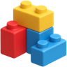

<p align="center">
  <a href="https://platform-blocks.com/" rel="noopener" target="_blank"></a>
</p>

<h1 align="center">Platform Blocks</h1>

<div align="center">

[](https://github.com/joshstovall/platform-blocks/blob/HEAD/LICENSE)
[](https://discord.gg/kbHjwzgXbc)
[](https://x.com/platform_blocks)

</div>

[Platform Blocks](https://platform-blocks.com/) is a React Native UI component library for building intuitive, accessible, and highly customizable mobile and web applications.

## Packages

| Package | Description | Version |
| --- | --- | --- |
| [`@platform-blocks/ui`](./packages/ui) | 80+ UI components — inputs, navigation, overlays, media, theming, and more | [](https://www.npmjs.com/package/@platform-blocks/ui) |
| [`@platform-blocks/charts`](./packages/charts) | 25 data visualization chart types with animations and interactions | [](https://www.npmjs.com/package/@platform-blocks/charts) |

## Installation

```sh
npm i @platform-blocks/ui
npm i @platform-blocks/charts
```

## Key features

- **Cross-platform** — iOS, Android, and Web from a single codebase
- **80+ components** — Comprehensive set of UI primitives and complex widgets
- **25 chart types** — Bar, Line, Area, Pie, Scatter, Radar, Heatmap, and more
- **Themeable** — Built-in light/dark themes with full customization support
- **Accessible** — Screen reader, keyboard navigation, and RTL support
- **Animated** — Smooth transitions powered by `react-native-reanimated`
- **Tree-shakeable** — Optimized ESM and CJS builds

## Documentation

Full documentation and examples are available at [platform-blocks.com](https://platform-blocks.com).

- [Getting started](https://platform-blocks.com/getting-started)
- [Component gallery](https://platform-blocks.com/components)
- [Interactive examples](https://platform-blocks.com/examples)
- [Theming](https://platform-blocks.com/theming)
- [Accessibility](https://platform-blocks.com/accessibility)
- [llms.txt](https://platform-blocks.com/llms.txt) — Full API reference for LLMs and AI assistants

## Contributing

Read the [contributing guide](CONTRIBUTING.md) to learn how to set up the development environment.

## License

This project is licensed under the [MIT License](LICENSE).